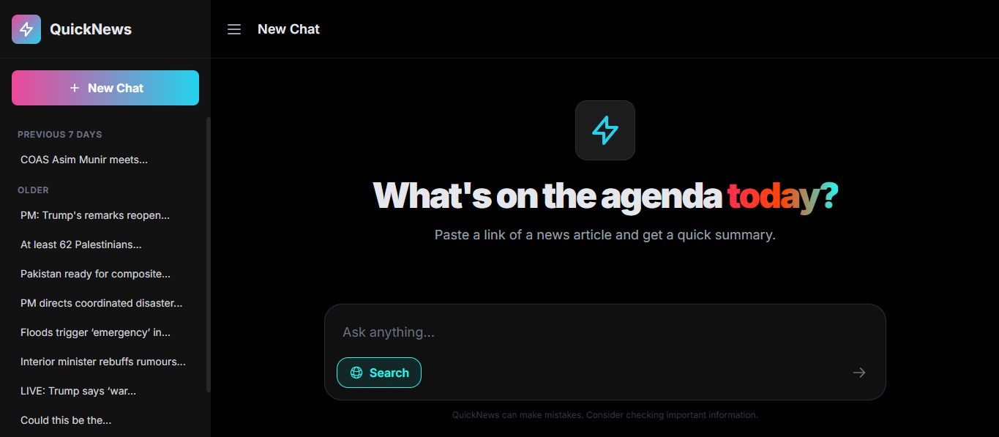

# 📢 QuickNews: AI-Powered News Summarizer & Insight Engine

<div align="center">



An intelligent web application that leverages the **[Google Gemini API](https://aistudio.google.com/)** to instantly summarize news articles, answer complex questions, and deliver insights through a modern, conversational UI.

</div>

---

## 📌 Table of Contents
- [About](#-about)
- [Key Features](#-key-features)
- [Tech Stack](#-tech-stack)
- [Getting Started](#-getting-started)
- [Roadmap](#-roadmap)
- [Contributing](#-contributing)
- [License](#-license)
- [Contact](#-contact)

---

## 📰 About

In today's fast-paced world, staying informed is essential — but reading lengthy articles can be time-consuming.  

**QuickNews** solves this by providing **concise, AI-generated summaries** from any news article URL.

It's more than just a summarizer — QuickNews is also an **answer engine**. You can ask any question, and it will:
- Perform a **web search** (if needed)
- Scrape and analyze multiple top sources **concurrently**
- Use the **Google Gemini API** to deliver accurate, context-aware responses

The app combines a **robust Django backend** with a **sleek, responsive JavaScript frontend** for a seamless experience.

---

## ✨ Key Features

- **🤖 Dual-Mode AI Processing**
  - **URL Summarization**: Paste a news link to get a quick, accurate summary, author details, and sentiment analysis.
  - **Intelligent Q&A**: Ask natural-language questions and receive direct, AI-powered answers.

- **🌐 Context-Aware Search**
  - Automatically searches the web and scrapes top results when additional context is needed.

- **⚡ High-Performance Backend**
  - Built with Django and **optimized for concurrency** in web scraping to keep responses fast.

- **💬 Modern Conversational UI**
  - Clean, chat-based interface styled with Tailwind CSS for a smooth, app-like feel.

- **🗂 Persistent Chat History**
  - Save and revisit all summarized articles, grouped by date.

---

## 🛠 Tech Stack

**Backend**
- [Django](https://www.djangoproject.com/)
- Concurrent web scraping with [BeautifulSoup](https://www.crummy.com/software/BeautifulSoup/)

**Frontend**
- Vanilla JavaScript
- [Tailwind CSS](https://tailwindcss.com/)

**AI / NLP**
- [Google Gemini API](https://aistudio.google.com/)
- [NLTK](https://www.nltk.org/)
- [Newspaper3k](https://newspaper.readthedocs.io/en/latest/)
- [TextBlob](https://textblob.readthedocs.io/en/dev/)

---

## 🚀 Getting Started

Follow these steps to set up QuickNews locally.

### **Prerequisites**
- [Python 3.10+](https://www.python.org/downloads/)
- API Key from [Google AI Studio](https://aistudio.google.com/)

---

### **Installation**

**1️⃣ Clone the repository**
```bash
git clone https://github.com/Muhammedbeig/QuickNews.git
cd QuickNews
```

**2️⃣ Create and activate a virtual environment**
```bash
# For Windows
python -m venv venv
.\venv\Scripts\activate

# For macOS/Linux
python3 -m venv venv
source venv/bin/activate
```

**3️⃣ Install dependencies**
```bash
pip install -r requirements.txt
```

**4️⃣ Set up environment variables**

Create a `.env` file in the project root:
```env
GEMINI_API_KEY="YOUR_API_KEY_HERE"
```

**5️⃣ Run the NLTK downloader**
```python
import nltk
nltk.download('punkt')
```

**6️⃣ Apply database migrations**
```bash
python manage.py migrate
```

**7️⃣ Run the development server**
```bash
python manage.py runserver
```

The application will be available at `http://127.0.0.1:8000/`.

---

## 🗺 Roadmap

- [ ] User authentication and dedicated accounts
- [ ] Ability to customize summary length and style
- [ ] Enhanced data visualizations for search results
- [ ] Support for summarizing PDF documents and other file types
- [ ] Dockerize the application for easy deployment

📌 See the [open issues](https://github.com/Muhammedbeig/QuickNews/issues) for a full list of proposed features and known issues.

---

## 🤝 Contributing

Contributions are welcome! 🎉

1. Fork the repo
2. Create your Feature Branch (`git checkout -b feature/AmazingFeature`)
3. Commit your changes (`git commit -m 'Add some AmazingFeature'`)
4. Push to the branch (`git push origin feature/AmazingFeature`)
5. Open a Pull Request

If you have a suggestion, feel free to open an issue with the tag "enhancement".
Don't forget to ⭐ the project if you like it!

---

## 📄 License

Distributed under the MIT License. See `LICENSE` for details.

---

## 📬 Contact

**Muhammad Beig**
- 📧 Email: muhammed.beig@icloud.com
- 💼 LinkedIn: [Muhammad Beig](https://linkedin.com/in/muhammad-beig)
- 🔗 Project Link: [QuickNews on GitHub](https://github.com/Muhammedbeig/QuickNews)
